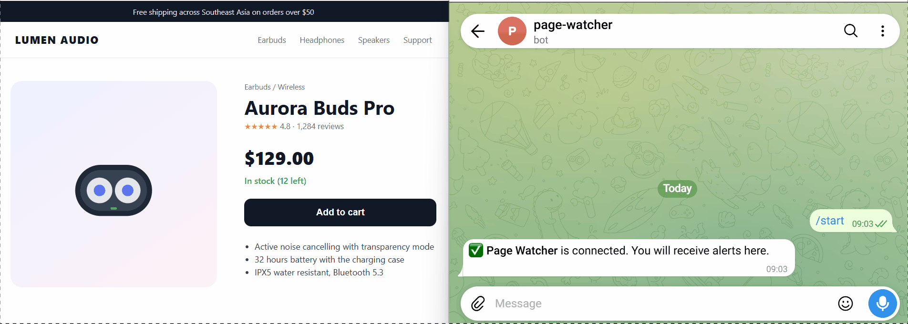

# Page Watcher – Web Change Alerts (Chrome Extension)

Watch any number or text on any web page and get an **instant Telegram message** (or desktop notification) when it changes: a price drop, stock coming back, a new order count on a dashboard, a status turning "Approved".

> **Problem it solves:** people refresh the same pages all day to see if something changed. Page Watcher does the checking for you and only interrupts you when it matters.

<!-- Record a 30–60s screen capture and save it as docs/demo.gif -->


**Live demo store to try it on:** https://kurniawan-dev12.github.io/page-watcher-extension/ (click the buttons in the yellow "Demo controls" box to change the price or stock)

## Features

- **Point-and-click picker**: hover over the page, click the value, done. No CSS knowledge needed.
- **Alert rules**: value changes · number goes above / below a threshold · text appears (e.g. "In stock")
- **Smart alerts**: threshold rules fire once when the value *crosses* the line, not on every check
- **Understands price formats**: `$1,299.00`, `Rp 1.250.000`, `1.299,50 €`
- **Telegram + desktop notifications**, with a link back to the page
- **Works on JavaScript-heavy pages and logged-in dashboards**: reads the live tab if it is open, otherwise fetches the page in the background with your session
- **History** of every value change, pause/resume, and "Check now"
- **Light and dark mode**, Manifest V3, no external servers — your data stays in your browser

## Install (developer mode)

1. Download or clone this repository.
2. Open `chrome://extensions` and switch on **Developer mode** (top right).
3. Click **Load unpacked** and select the `extension` folder.
4. Pin **Page Watcher** to the toolbar.

## Use

1. Open a page, click the Page Watcher icon → **Watch an element on this page**.
2. Click the value you want to watch, choose a rule and how often to check, then **Start watching**.
3. Optional: ⚙️ Settings → add your Telegram bot token and chat ID → **Send test message** → **Save**.

## How it works

```
extension/
├── manifest.json      Manifest V3 config
├── background.js      Service worker: alarms, reading values, alerts (only writer of stored data)
├── picker.js          Injected on demand: element picker + rule panel (Shadow DOM, isolated from page CSS)
├── offscreen.js/html  Parses fetched HTML with DOMParser (service workers have no DOM)
├── popup.*            List of watchers, history, check now / pause / delete
├── options.*          Telegram and notification settings
└── lib/core.js        Pure logic: number parsing, alert rules, formatting (unit-tested)
docs/index.html        Demo store page (GitHub Pages) with buttons to change price and stock
tests/                 Node test runner tests for lib/core.js
```

Reading strategy: if the watched page is open in a tab, the value is read from the live page (so client-side rendered sites work). If not, the page is fetched with the user's cookies and parsed offscreen. Storage writes are serialized, so several watchers checking at the same time never overwrite each other.

**Permissions:** `<all_urls>` is needed to read the pages you choose to watch and to call the Telegram API. Nothing is sent anywhere except your own Telegram bot.

## Tests

```bash
npm test      # Node 18+, no dependencies
```

## Ideas for client versions

Watch many product URLs from a Google Sheet · daily summary report · webhook / Slack / LINE alerts · auto-click an action when a condition is met · team dashboard.

---

Built by **Kurniawan** — automation developer (Chrome extensions, Telegram bots, Google Sheets). Need a custom monitor for your business? Contact me on Upwork.
